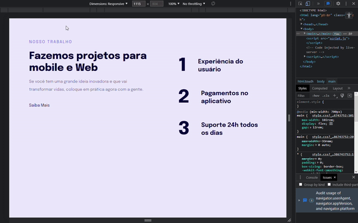

<h1 align="center">Projeto 08 (Stage 3) - Explorer  Responsividade</h1>

Para todos os gostos (e dispositivos haha) 😎

  

 

  <a href="#-Progresso">Progresso</a>&nbsp;&nbsp;&nbsp;|&nbsp;&nbsp;&nbsp;
  <a href="#-Objetivo">Objetivo</a>&nbsp;&nbsp;&nbsp;|&nbsp;&nbsp;&nbsp;
  <a href="#-Tecnologias">Tecnologias</a>&nbsp;&nbsp;&nbsp;|&nbsp;&nbsp;&nbsp;
  <a href="#-Conhecimentos-adquiridos">Conhecimentos adquiridos</a>
  &nbsp;&nbsp;&nbsp;|&nbsp;&nbsp;&nbsp;
  <a href="#-Projeto">Projeto</a>
  &nbsp;&nbsp;&nbsp;|&nbsp;&nbsp;&nbsp;
  <a href="#-Layout">Layout</a>
  &nbsp;&nbsp;&nbsp;|&nbsp;&nbsp;&nbsp; 
  <a href="#-Licença">Licença</a>&nbsp;&nbsp;&nbsp;|&nbsp;&nbsp;&nbsp;

 

 

## 🗓️ Progresso

  <table>
    <tr align="center">
      <th>🚩 INICIADO</th>
      <th>✅ FINALIZADO</th>
    </tr>
    <tr align="center">
      <td>14/02/2023</td>
      <td>14/02/2023</td>
    </tr>
  </table>

 

## 🎯 Objetivo

    Realizar a construção de um layout responsivo, ou seja, utilizável tanto para dispositivos Desktop quanto mapa Mobile.

 

## 🚀 Tecnologias

- HTML5 e CSS3
- Git e Github
- Figma

 

## 🧠 Conhecimentos adquiridos

- <Strong>CSS:</strong> ":first-child"; "seletor 1" + "seletor 2" {}; "@media".
   

 

## 💻 Projeto

- Acesse o projeto finalizado aqui -> [🏆](https://pedro-suassuna.github.io/Projeto11_DesignResponsivo_Explorer)

 

## 🔖 Layout

Acesse o Layout base para o projeto aqui -> [🎨](<https://www.figma.com/file/1e2gmvkdRCFJ3cHlO3jtgZ/Explorer-Stage-03-Projeto-02-(Copy)?node-id=203%3A412&t=MzQI7cYcs5NGMAks-0>).
 

- OBS: É necessário ter conta no [Figma](https://figma.com) para acessá-lo.

 

## 📖 Licença

    Esse projeto está sob a licença MIT.
